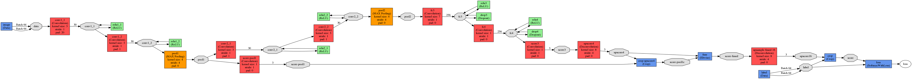
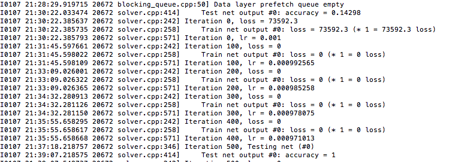

# 预测脑瘤区域

## 目标
给出4种同一个大脑的同一角度的几种*图（不是医学专业的并不关心是啥。。。）要求对于每一个像素点判断他是
	
	1. 正常（黑色）
	2. 水肿（灰色）
	3. 肿瘤（白色）
	
## 算法
采用深度学习的算法进行区分（卷积神经网络）  
我们采用FCN(fully convolution network)的类似的结构。神经网络结构如下:
	
	1. 卷积 (with ReLU)
	2. 卷积 (with ReLU)
	3. POOLING 
	4. 卷积 (with ReLU)
	5. 卷积 (with ReLU)
	6. 全连接卷积 
	7. 全连接卷积
	8. 全连接卷积
	9. 上采样
	10. 剪裁层，将图片大小裁剪到第三层大小
	11. 将第三层POOLING加一层全连接卷积层与第十层加和
	11. 上采样
	12. 剪裁层，将图片上采样到输入大小
	
详细请见  

这个简化过的算法基本保留了fcn网络的基本语义。由于需要分的类别只有3个。我们将vgg16网络大幅度简化，只保留4层卷积。全连接卷积层的大小缩小。结果仍非常好。  

此处有优化的空间，反卷积层可以要变成3层的结构，网络的能力会更高和占用空间会更小(AlexNet -> VGGnet的优化策略)

## 数据处理
输入中所有图都只有灰度这一大小，我们将4个输出当做4个颜色通道feed给神经网络。  
对于输出，所有图3值化:

	1. 0~99，正常，label 0
	2. 100~200，水肿, label 1
	3. 201~255，瘤，label 2
	
由于数据实在太少，我们对图进行了顺时针90°，180°，270°的旋转，并将新的图加入数据集。这样图片就有了264张。

## 实验结果

实验效果非常好，仅仅100次训练，图片对于训练集的误差已经变为0.在经过500次训练之后，在测试集上也达到了100%的像素级分类。

## 其他

本实验采用[caffe](https://github.com/BVLC/caffe)深度学习框架  
报告所提到的[FCN(fully convolution network)](http://arxiv.org/pdf/1411.4038v1.pdf)